Оглавление:

[[_TOC_]]

## Part 1. Готовый докер

- Взять официальный докер образ с nginx и выкачать его при помощи docker pull

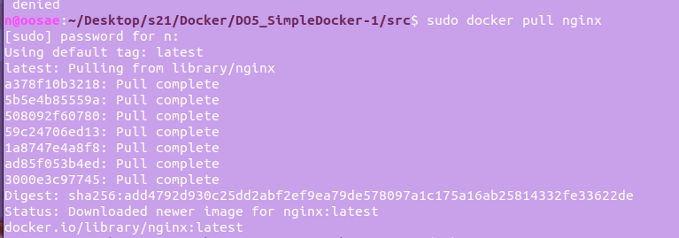

_Вывод команды docker pull nginx_

- Проверить наличие докер образа через docker images

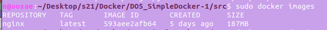

_Вывод команды docker images_

- Запустить докер образ через docker run -d [image_id|repository]

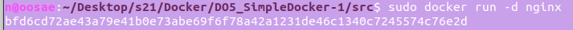

_Вывод команды docker run -d nginx_

- Проверить, что образ запустился через docker ps

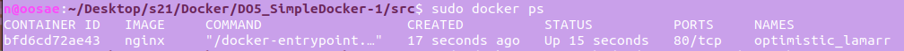

_Вывод команды docker ps_

- Посмотреть информацию о контейнере через docker inspect [container_id|container_name]

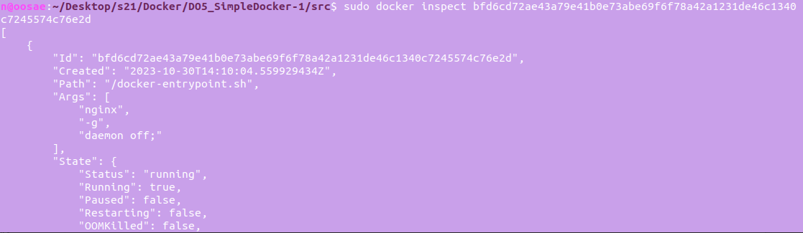

_Вывод команды docker inspect_ 

- По выводу команды определить и поместить в отчёт размер контейнера, список замапленных портов и ip контейнера

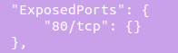

_Замапленные порты_

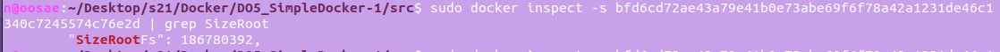

_Размер контейнера_

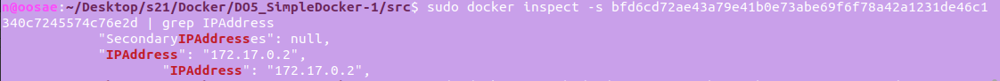

_IP контейнера_

- Остановить докер образ через docker stop [container_id|container_name]

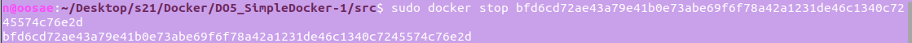

_Вывод команды docker stop_

- Проверить, что образ остановился через docker ps

_Вывод команды docker ps_

- Запустить докер с портами 80 и 443 в контейнере, замапленными на такие же порты на локальной машине, через команду run

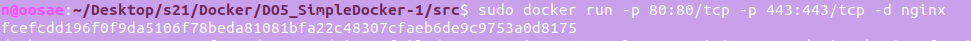

_Вывод команды docker run -p 80:80/tcp -p 443:443/tcp -d nginx_

- Проверить, что в браузере по адресу localhost:80 доступна стартовая страница nginx

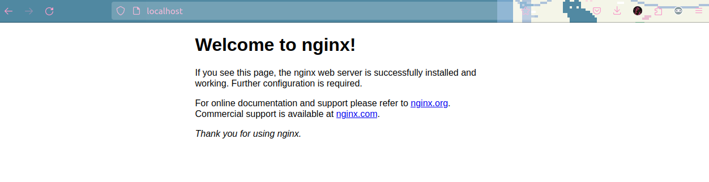

_Страница в браузере по адресу localhost:80_

- Перезапустить докер контейнер через docker restart [container_id|container_name]

_Вывод команды docker restart_

- Проверить любым способом, что контейнер запустился

_Страница в браузере по адресу localhost:80_

## Part 2. Операции с контейнером

- Прочитать конфигурационный файл nginx.conf внутри докер контейнера через команду exec

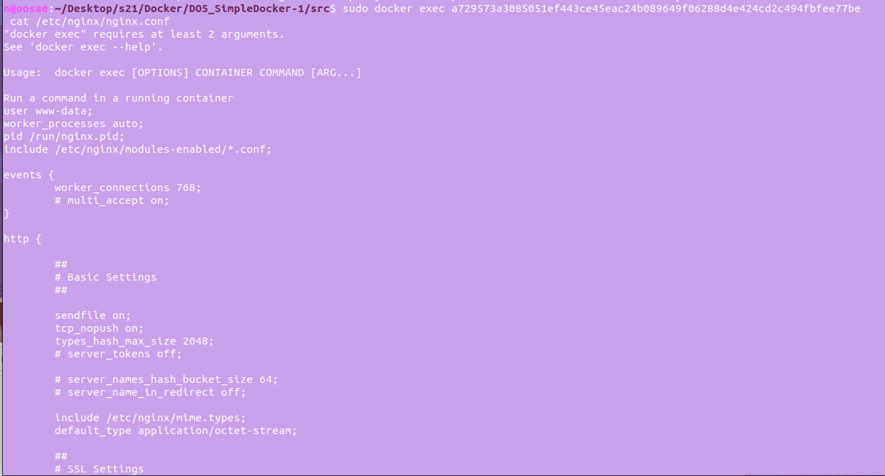

_Файл конфигурации_

- Создать на локальной машине файл nginx.conf

- Настроить в нем по пути /status отдачу страницы статуса сервера nginx

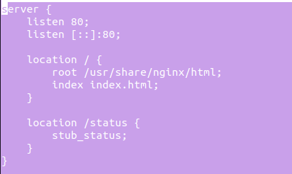

_Создание файла nginx.conf в nano_

- Скопировать созданный файл nginx.conf внутрь докер образа через команду docker cp

- Перезапустить nginx внутри докер образа через команду exec

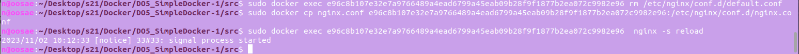

_Вывод команд rm, cp, reload для контейнера_

- Проверить, что по адресу localhost:80/status отдается страничка со статусом сервера nginx

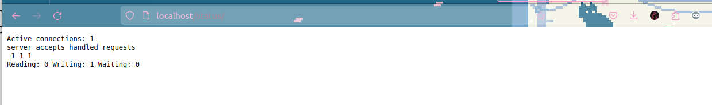

_Страница в браузере по адресу localhost:80/status_

- Экспортировать контейнер в файл container.tar через команду export

- Остановить контейнер

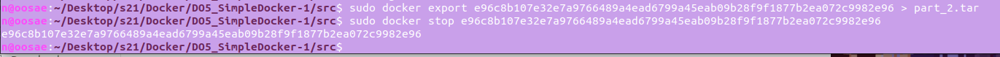

_Вывод команд export, rm для контейнера_

- Удалить образ через docker rmi [image_id|repository], не удаляя перед этим контейнеры

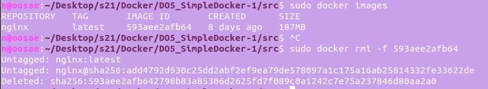

_Вывод команд images, rmi для контейнера_

- Удалить остановленный контейнер

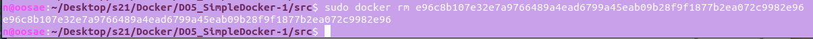

_Вывод команды rm для контейнера_

- Импортировать контейнер обратно через команду import

- Запустить импортированный контейнер

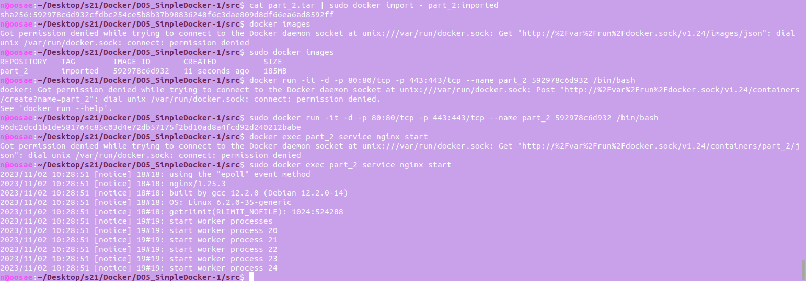

_Вывод команды import, images, run, start для контейнера_

- Проверить, что по адресу localhost:80/status отдается страничка со статусом сервера nginx

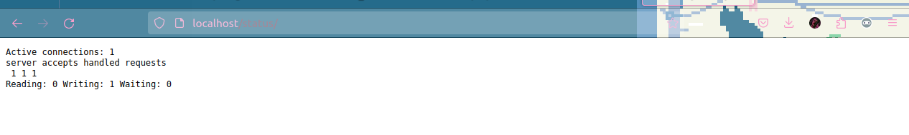

_Страница в браузере по адресу localhost:80/status_
